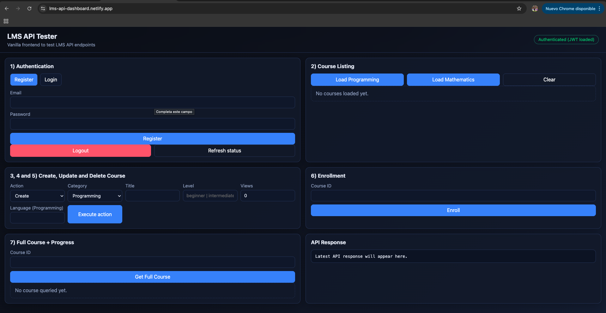
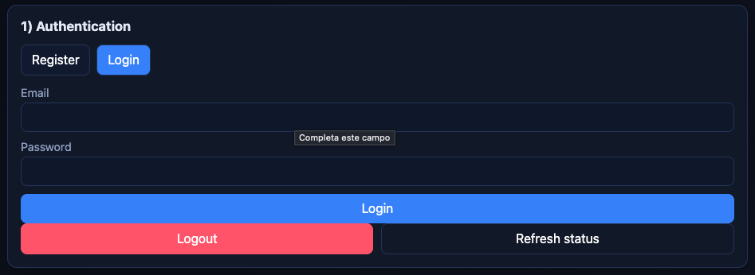
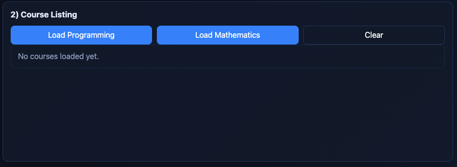
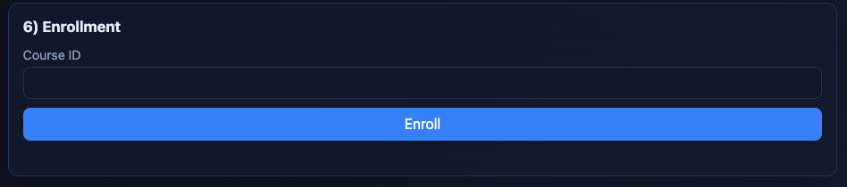
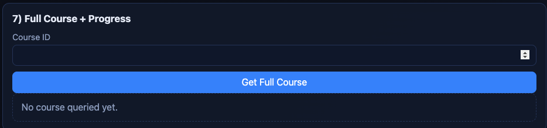
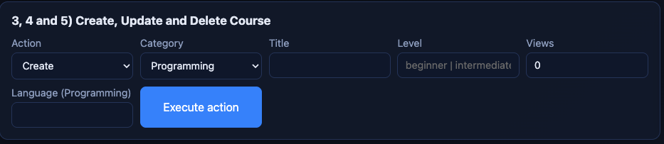
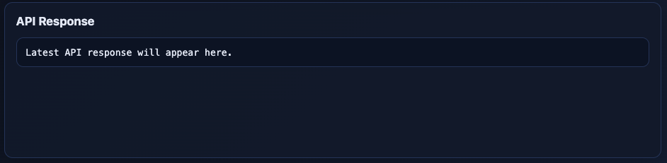
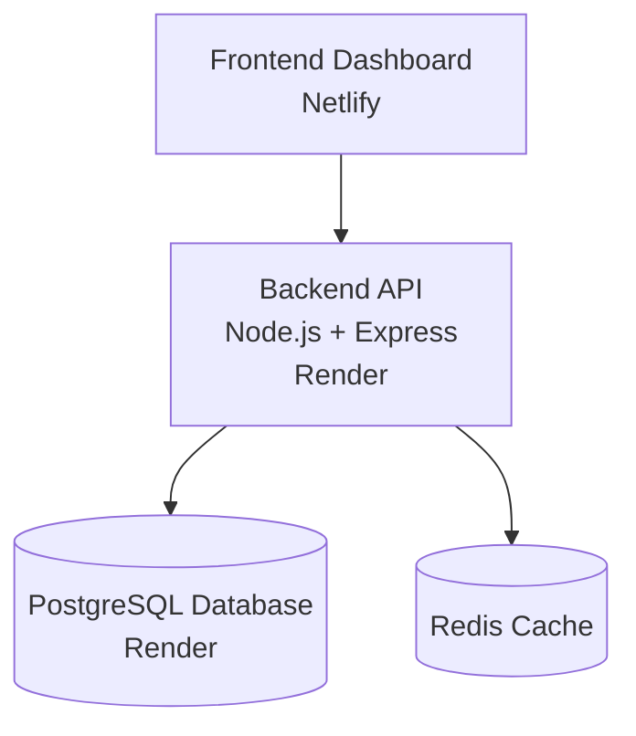

# Educational LMS API


Production-ready **REST API for an educational learning platform** built with **Node.js, Express, PostgreSQL, Redis and Docker** following a clean architecture approach.

This project demonstrates modern backend engineering practices including:

* JWT authentication with refresh token rotation
* Redis caching strategies
* Role-based authorization
* Structured logging
* Dockerized infrastructure
* Integration testing with database isolation
* Cloud deployment

The backend is fully deployed and connected to a **frontend dashboard that allows testing the API directly from the browser**.

---

# 🌐 Live Demo

Frontend Dashboard

https://lms-api-dashboard.netlify.app

Backend API

https://educational-backend-api.onrender.com

Example endpoint

```
GET /
```

---

# 🖼 Dashboard Preview

This dashboard allows testing the full backend API directly from the browser.

| Login                      | Dashboard                          |
| -------------------------- | ---------------------------------- |
|  |  |

| Course List                            | Course Enrollment                           |
| -------------------------------------- | ------------------------------------------- |
|  |  |

| Course Progress                         | Course CRUD                            |
| --------------------------------------- | -------------------------------------- |
|  |  |

### API Response Viewer



---

# 🏗 System Architecture



This architecture simulates a **real production backend environment** where the frontend interacts with a cloud-hosted API backed by a relational database and a caching layer.

---

# 🚀 Features

### Authentication

* User registration
* User login
* JWT authentication
* Access + Refresh Token rotation
* Secure refresh token storage (hashed)
* Token expiration strategy

### Course Platform

* Create courses
* Update courses
* Delete courses
* List courses
* View course details
* Course enrollment

### Learning System

* Course sections
* Course lessons
* Lesson completion tracking
* Course progress calculation

### User Features

* Favorite courses
* Progress tracking
* Enrollment management

### Performance

* Redis caching
* Cache-aside pattern
* Pattern-based cache invalidation

### AI Features

* Protected AI endpoint
* Role-based access
* Rate limiting

---

# ⚡ Redis Caching Strategy

This project implements the **Cache-Aside pattern**.

Cached resources

* Course list
* Course by ID

Invalidation strategy

* Cache cleared after course mutations
* Pattern-based cache invalidation

Benefits

* Reduced database load
* Faster responses
* Scalable backend architecture

---

# 📡 API Endpoints

| Method | Endpoint                      | Description               |
| ------ | ----------------------------- | ------------------------- |
| POST   | /api/courses/auth/register    | Register user             |
| POST   | /api/courses/auth/login       | Login user                |
| GET    | /api/courses/programming      | Get programming courses   |
| GET    | /api/courses/mathematics      | Get mathematics courses   |
| POST   | /api/courses                  | Create course             |
| PUT    | /api/courses/:id              | Update course             |
| DELETE | /api/courses/:id              | Delete course             |
| POST   | /api/enrollment/:courseId     | Enroll user               |
| GET    | /api/courses/:id/full         | Get full course structure |
| POST   | /api/progress/complete-lesson | Complete lesson           |
| POST   | /api/favorites/:courseId      | Add favorite              |

---

# 🐳 Docker Setup

The application runs using **Docker Compose**.

Services:

* Backend API
* PostgreSQL database
* Redis cache

Run locally

```bash
docker compose up --build
```

Stop services

```bash
docker compose down
```

---

# 📁 Project Structure

```
controllers/
services/
infrastructure/
   redis/
middlewares/
routers/
utils/
config/
tests/

docker-compose.yml
Dockerfile
```

Architecture layers

Controllers → HTTP layer
Services → Business logic
Infrastructure → Database and Redis
Middlewares → Auth / Errors / Roles

---

# 🛠 Tech Stack

Backend

* Node.js
* Express

Database

* PostgreSQL

Cache

* Redis

Authentication

* JWT
* Refresh Token Rotation

Infrastructure

* Docker
* Docker Compose

Testing

* Jest
* Supertest

Logging

* Winston

Deployment

* Render (Backend + Database)

Frontend Integration

* Netlify Dashboard

---

# 🔐 Environment Variables

Example `.env`

```
PORT=3000

DATABASE_URL=
DATABASE_URL_TEST=

JWT_ACCESS_SECRET=
JWT_ACCESS_EXPIRES_IN=15m

JWT_REFRESH_SECRET=
JWT_REFRESH_EXPIRES_IN=7d

REDIS_URL=redis://redis:6379
```

---

# 🧪 Testing

Integration tests run against a **separate test database**.

Run tests

```
npm test
```

Testing tools

* Jest
* Supertest

---

# 🧠 Why This Project Matters

This project demonstrates **real backend engineering practices used in production systems**:

* Secure authentication strategies
* Token rotation
* Cache-aside architecture
* Database + caching layers
* Dockerized infrastructure
* Cloud deployment
* Integration testing
* Clean architecture design

It simulates the backend architecture of a **real educational platform**.

---

# ⚙ Production Considerations

In a production environment this system could be extended with:

* Kubernetes orchestration
* CI/CD pipelines
* distributed caching
* monitoring (Prometheus / Grafana)
* API documentation (OpenAPI / Swagger)
* rate limiting with Redis
* background workers

---

# 👨‍💻 Author

Sebastian Olarte
Backend Developer
